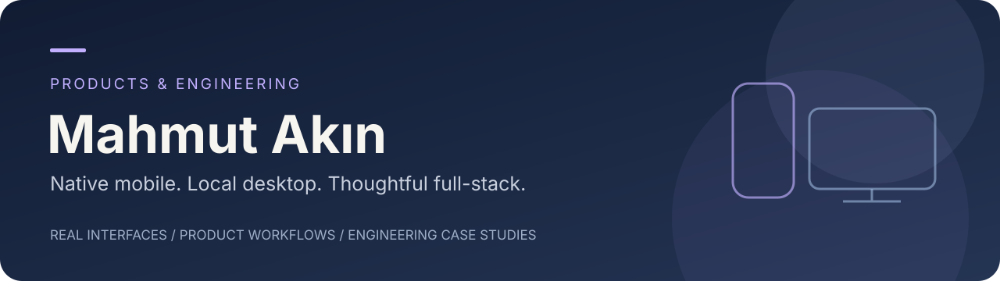
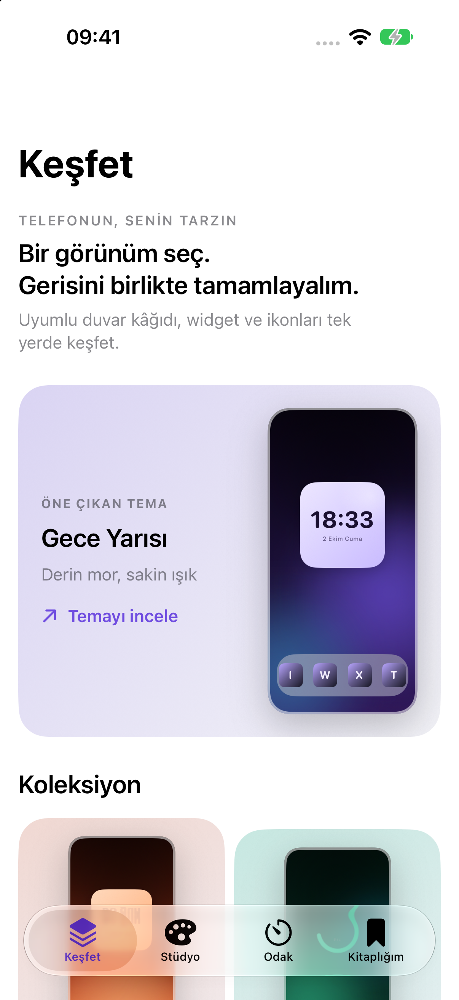
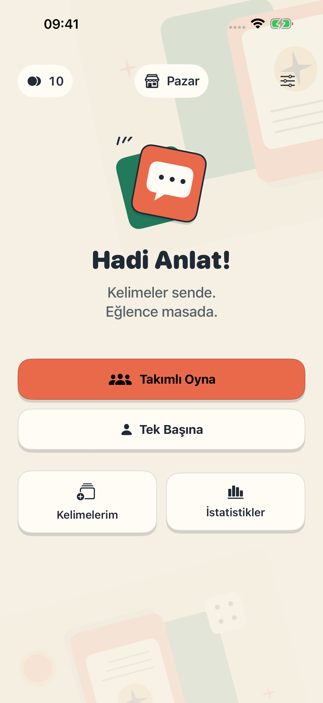
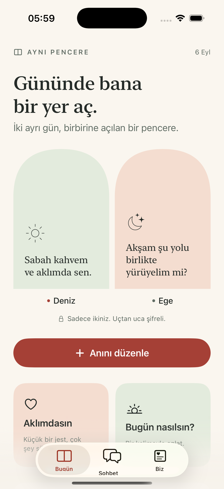
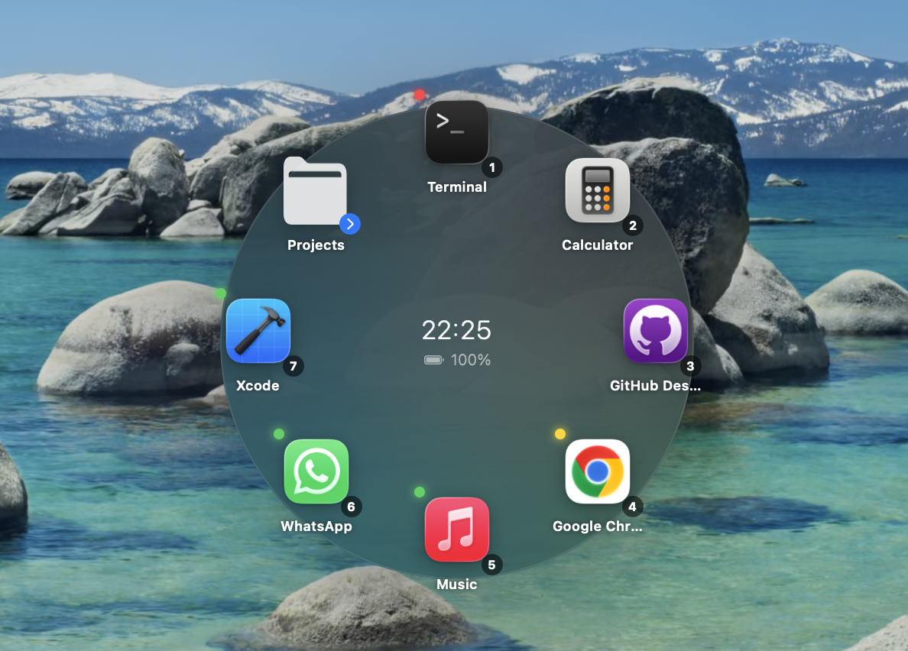

# Ürünler, arayüzler ve mühendislik

iPhone'da kişisel bir görünüm, Mac'te daha hızlı bir çalışma alanı, yerel fotoğraf işleme ve iki kişilik iletişim: geliştirdiğim uygulamaları gerçek ekranları ve ürün akışlarıyla burada bir araya getiriyorum.

Kaynak kodu private depolarda tutulur. Burada kodsuz tanıtımlar ve vaka çalışmaları bulunur. **English summaries are available in the linked showcases and case studies.**

## Öne çıkan uygulamalar

<table>
<tr>
<td width="33%" align="center"><a href="https://github.com/Mahmutakin99/Prizma-showcase"><strong>Prizma</strong> </a> iPhone kişiselleştirme stüdyosu</td>
<td width="33%" align="center"><a href="https://github.com/Mahmutakin99/Tabu-showcase"><strong>Hadi Anlat!</strong> </a> Masayı bir araya getiren kelime oyunu</td>
<td width="33%" align="center"><a href="https://github.com/Mahmutakin99/SoulMate-showcase"><strong>SoulMate</strong> </a> İki kişilik iletişim alanı</td>
</tr>
</table>

<table>
<tr>
<td width="50%"><a href="https://github.com/Mahmutakin99/Orbit-showcase"><strong>Orbit</strong> </a> Kısayollar ve sistem izleme, imlecin etrafında.</td>
<td width="50%"><a href="https://github.com/Mahmutakin99/pixelmend-showcase"><strong>PixelMend</strong> </a> Yerel fotoğraf onarma, büyütme ve düzenleme.</td>
</tr>
</table>

| Ürün | Platform | İncele |
| --- | --- | --- |
| Prizma | iOS | [Tema, widget ve ikon stüdyosu](https://github.com/Mahmutakin99/Prizma-showcase) |
| Hadi Anlat! / Tabu | iOS | [Solo ve takımlı kelime oyunu](https://github.com/Mahmutakin99/Tabu-showcase) |
| SoulMate | iOS | [Günlük anlar ve sohbet](https://github.com/Mahmutakin99/SoulMate-showcase) · [Vaka](projects/soulmate.md) |
| Orbit | macOS | [Dairesel başlatıcı](https://github.com/Mahmutakin99/Orbit-showcase) · [v1.5.0 paketi](https://github.com/Mahmutakin99/Orbit-showcase/releases/tag/v1.5.0) |
| PixelMend | macOS Apple Silicon / Windows x64 RC | [Yerel fotoğraf işleme](https://github.com/Mahmutakin99/pixelmend-showcase) · [RC.2 kurulum paketleri](https://github.com/Mahmutakin99/pixelmend-showcase/releases/tag/v1.0.0-rc.2) |
| Yolcu | Mobil web / PWA prototipi | [Dijital karakter ve yolculuk deneyimi](https://github.com/Mahmutakin99/project-portfolio/tree/main/showcases/Yolcu) |

Görseller gerçek uygulamalardan ve belirtilmiş örnek veri akışlarından gelir. Her vitrinde sürüm, görsel kökeni ve kullanılabilirlik bilgisi bulunur.

## Diğer ürünler ve vaka çalışmaları

| Proje | Odak | İncele |
| --- | --- | --- |
| SubTrack | Abonelikler ve tekrar eden giderler | [Vitrin](https://github.com/Mahmutakin99/SubTrack-showcase) · [Vaka](projects/subtrack.md) |
| Heey | Yerelden başlayan şifreli mesajlaşma | [Vitrin](https://github.com/Mahmutakin99/Heey-showcase) · [Vaka](projects/heey.md) |
| SmartDoc Query | PDF, OCR ve anlamsal belge arama | [Vitrin](https://github.com/Mahmutakin99/SmartDoc-Query-showcase) · [Vaka](projects/smartdoc-query.md) |
| ChatLy | Native iOS mesajlaşma prototipi | [Vitrin](https://github.com/Mahmutakin99/ChatLy-showcase) · [Gerçek giriş ekranı ve vaka](projects/chatly.md) |
| Elerivo / Junior | Ayrı öğrenme ürünleri için ortak altyapı | [Vitrin](https://github.com/Mahmutakin99/project-portfolio/tree/main/showcases/Elerivo) · [Vaka](projects/elerivo.md) |
| Particle Detector recorder | Masaüstü ve web ölçüm kaydı | [Vitrin](https://github.com/Mahmutakin99/project-portfolio/tree/main/showcases/particle-detector) · [Katkı ve atıflar](projects/particle-detector.md) |
| Work Tracking System | Kurum içi proje ve görev iş akışları | [Vitrin](https://github.com/Mahmutakin99/project-portfolio/tree/main/showcases/work-tracking) · [Kodsuz vaka](projects/aso-work-tracking-system.md) |
| Physics & Astronomy Society CMS | İçerik yönetimi ve yönetim paneli | [Vitrin](https://github.com/Mahmutakin99/project-portfolio/tree/main/showcases/society-cms) · [Vaka](projects/physics-astronomy-cms.md) |

Doğrulanmış ekran görüntüsü bulunmayan eski projelerde simgeler ve ürün akışları kullanıldı. Kurum içi gerçek kullanıcı, görev ve operasyon ekranları paylaşılmaz.

## Öğrenme projeleri

[Öğrenme ve küçük araçlar kataloğu](projects/learning-projects.md): Python ve C alıştırmaları, Pong, Snake, Flappy Bird, ColorCatch, Quiz, ZarAt, KuantumKaos, UstaPlatform ve Claude Code statusline.

[Nesto](projects/nesto.md) önceki portföyden korunmuş bir vaka çalışmasıdır; güncel GitHub envanterinde kaynak deposu doğrulanmadı.

## Sunum yaklaşımı

[LocalSend](https://github.com/localsend/localsend), [Stats](https://github.com/exelban/stats) ve [AltTab](https://github.com/lwouis/alt-tab-macos) sayfalarındaki kısa ürün tanımı, görsel hiyerarşi, belirgin kullanım bağlantıları ve kolay bulunan destek alanları referans alındı. Metinler bu projeler için özgün hazırlandı. [İçerik kapsamı](PRESENTATION.md).

## İletişim

[Mahmut Akın](https://github.com/Mahmutakin99) · [mahmutakn03@gmail.com](mailto:mahmutakn03@gmail.com)
