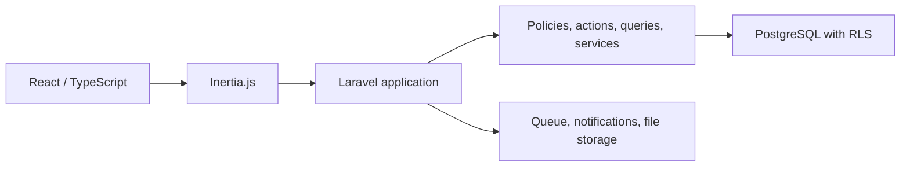

# ASO Work Tracking System

An internal project and task management platform developed during an Information Technology internship at the ASO 1st Organized Industrial Zone Directorate.

## Context

The IT & Communications Directorate needed a centralized workflow for work that had been distributed across spreadsheets, messaging, and third-party task tools.

## Contribution

Designed and developed a full-stack internal platform at the department manager's request, covering project setup, task assignment, personal work queues, managerial visibility, reporting, and controlled on-premises deployment.

## Core capabilities

- Personal task workspace with optimistic completion and undo
- Project list, Kanban, and calendar views
- Drag-and-drop task ordering and multi-criteria filtering
- Turkish full-text search and keyboard command palette
- Task details with assignees, labels, checklists, subtasks, custom fields, comments, attachments, and activity history
- Notifications for assignments, mentions, upcoming deadlines, and overdue work
- Manager dashboard with workload, project status, overdue work, and budget summaries
- Individual and bulk user administration through CSV/XLSX import
- CSV exports for project, personal, and dashboard views
- Project templates, scheduled summaries, and stale-task automation

## Engineering approach

The application uses Laravel and Inertia to keep authorization, validation, and domain workflows on the server while delivering a React/TypeScript interface. PostgreSQL row-level security provides database-level tenant isolation, and the production stack is prepared for Docker-based on-premises deployment.

## Technology

PHP, Laravel 13, Inertia.js 3, React 19, TypeScript, Tailwind CSS 4, PostgreSQL 17, Laravel Fortify, Docker, Pest, Vitest, PHPStan, ESLint, and TypeScript strict mode.

## Quality and security

- More than 700 backend and 160 frontend automated tests were maintained during development.
- PHPStan level 7 and TypeScript strict mode were used as quality gates.
- Database isolation, authorization policies, upload validation, append-only activity history, security headers, and dependency audits were included in the production-readiness work.

## Confidentiality

This case study intentionally excludes source code, real data, screenshots, infrastructure identifiers, network topology, and operational configuration. The institutional source repository is not available for public or private third-party distribution.

