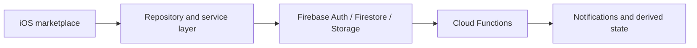

# Nesto

An iOS real estate marketplace for publishing listings, discovering properties, saving favorites, and connecting prospective users with listing owners.

## Problem

Open messaging in a marketplace can create unwanted conversations and make it difficult for listing owners to control who can contact them.

## Solution

Nesto introduces an approval-based matching flow. A prospective user sends a messaging request for a listing; the owner accepts or declines it, and a conversation can begin only after approval.

## Core capabilities

- Authentication and onboarding
- Listing creation, discovery, detail, and owner workflows
- Favorites and listing interaction tracking
- Approval-based match requests before messaging
- Push notifications and synchronized thread summaries
- Profile, privacy, blocking, reporting, and moderation flows
- Media upload and backend validation
- User and listing verification workflows

## Engineering approach

The iOS application separates feature presentation, repositories, services, data-access mappers, and dependency assembly. Firebase Cloud Functions maintain derived state and notifications for events such as match requests, messages, favorites, moderation reports, and verification updates.

## Technology

Swift, UIKit, selected SwiftUI components, MVVM, repository pattern, dependency injection, Firebase Auth, Firestore, Storage, Cloud Functions, Messaging, App Check, Crashlytics, MapKit, and TypeScript.

## Availability

Source code and backend configuration are private. A product demonstration or controlled technical walkthrough may be provided upon request.

