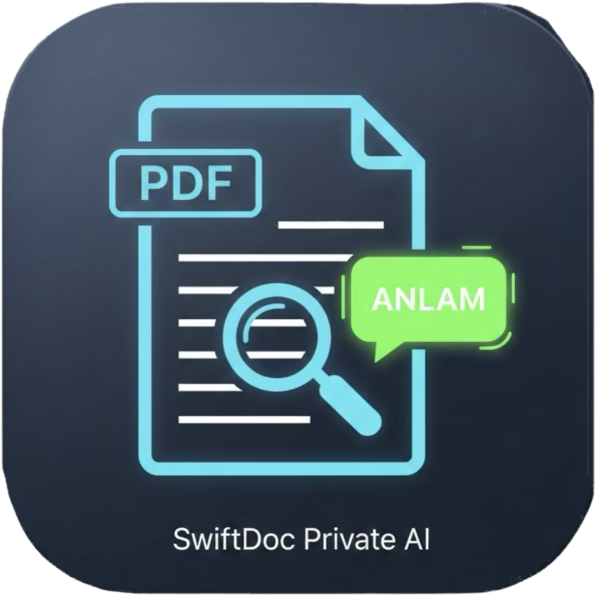

# SmartDoc Query

An iOS document-assistant prototype that connects PDF import, semantic retrieval, questions, and page-level source inspection.

**Stage:** implemented research prototype; source private. This case combines the overlapping SmartDoc-Query and SmartDoc-Query2 repositories.

## Problem and workflow

Exact keyword search is often insufficient for long documents or scanned PDFs. A useful assistant also needs to let readers inspect the source text behind an answer.

A reader imports a PDF, starts a document-specific conversation, asks a typed or spoken question, and opens the cited PDF page to inspect highlighted source text. A sidebar provides access to the document library and previous chats.

## Capabilities

- PDFKit text extraction with Vision OCR for scanned pages
- Text chunking without splitting words
- Core ML embedding interfaces and cosine-similarity retrieval
- BERT extractive question answering
- An availability-gated Apple Foundation Models answer path in the newer repository
- Page references and PDF source highlighting
- Speech input and spoken-answer support
- SQLite vector storage and persisted document/chat history

## Engineering approach

The application uses programmatic UIKit, MVVM, and a container controller for the library/chat experience. PDF processing, embedding generation, vector retrieval, answer selection, speech, and PDF display have separate responsibilities.

The newer repository contains BGE embedding integration, a packaged Core ML model, and a Foundation Models wrapper. The older variant retains the BERT-centered approach. Combining them into one case avoids presenting substantially overlapping development variants as two independent products.

## Technology

Swift, UIKit, PDFKit, Vision, Core ML, Natural Language, Foundation Models, Speech, AVFoundation, Accelerate, and SQLite.

## Evidence and limits

The repository READMEs and source inventories document the import, chat, OCR, library, retrieval, and citation flows. The newer answer manager checks model availability and falls back to BERT when the generative path is unavailable.

Local document processing is a design objective. Speech recognition availability and processing behavior depend on platform configuration; this presentation does not assert that every spoken-question path works fully offline. Answer grounding is an implementation intent, not a measured guarantee of factual accuracy. No hardware acceleration benchmark, model-quality evaluation, current device run, or App Store release was verified for this presentation.

The artwork above is an existing app icon, not a product screenshot. No verified screenshots with public-safe documents were available. Source, models, private documents, and backend configuration are not included.
