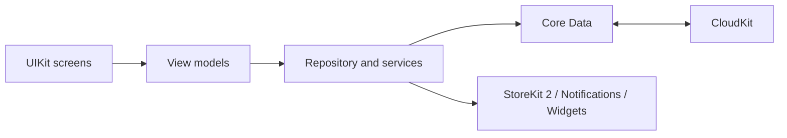

# SubTrack

An iOS subscription manager for tracking recurring payments, upcoming renewals, spending patterns, and subscription history across devices.

## Problem

Recurring expenses are often spread across different services and currencies, making it difficult to understand upcoming charges and total monthly cost.

## Solution

SubTrack combines subscription tracking, live exchange rates, reminders, analytics, iCloud synchronization, widgets, and export tools in one UIKit application.

## Core capabilities

- Monthly and annual billing cycles with TRY, USD, and EUR display
- Live exchange rates with persistent cache and offline fallback
- Upcoming-payment reminders and payment timeline
- Calendar, category analytics, projections, and spending insights
- iCloud synchronization through `NSPersistentCloudKitContainer`
- Home Screen and Lock Screen widgets
- Face ID / Touch ID application lock
- CSV and PDF export
- StoreKit 2 freemium flow and restore-purchases support
- Built-in templates for common subscription services

## Engineering approach

The application uses MVVM, repositories, and dedicated services for persistence, purchases, notifications, exchange rates, export, biometrics, and widget snapshots. A central feature-access evaluator keeps free and premium behavior consistent across screens.

## Technology

Swift, UIKit, MVVM, Core Data, CloudKit, StoreKit 2, WidgetKit, UserNotifications, LocalAuthentication, diffable data sources, Auto Layout, and a REST exchange-rate service.

## Availability

Source code is private while the product is under development. A demo build, video walkthrough, or controlled source review may be provided upon request.

