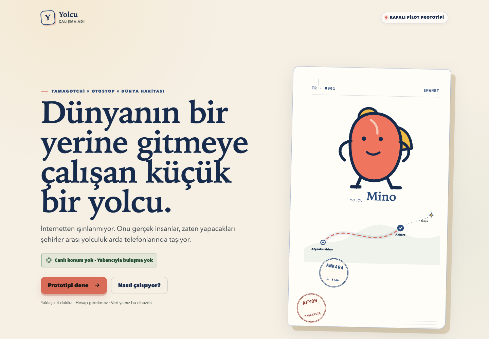
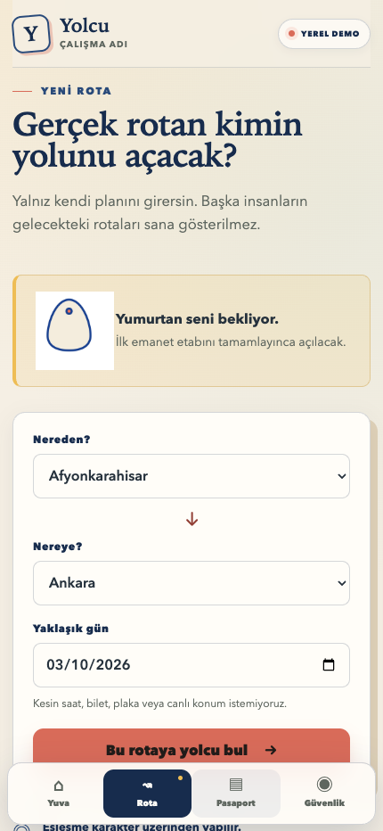
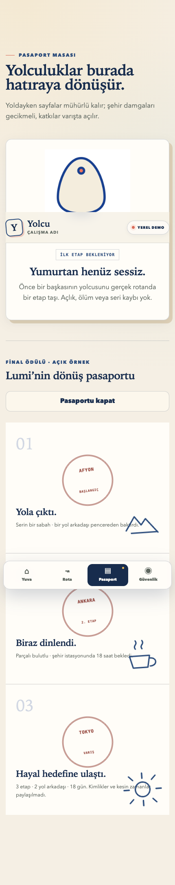

# Yolcu

**Let a small dream travel with you.** A mobile-first digital character world built around journeys people already plan to take.

[Try the public example journey](https://yolcu-blond.vercel.app/demo) · [Türkçe](README.md)

Choose a route, carry a character towards its next city, and leave a small contribution in its passport. The owner receives delayed city-level story updates rather than a carrier's live position, identity or future route. Care interactions are optional.

## Workflow

1. Choose departure, arrival and an approximate travel day.
2. Carry a character whose journey your route can advance.
3. Confirm arrival and optionally add a small contribution.
4. Explore the resulting passport or use a mutually confirmed handoff.

 

## Status

Yolcu is a working name for a closed-pilot prototype, designed for adults. The account-free demo uses synthetic data and simulated GPS/handoff behavior. It is not field acceptance evidence. The public landing and local development captures show different existing builds; [provenance](PROVENANCE.md) records the distinction.

The app uses React, TypeScript, PWA patterns and Capacitor integrations, with separate Supabase-backed beta workflows. Application source remains private.

[Feedback](https://github.com/Mahmutakin99/project-portfolio/issues/new/choose) · [Portfolio](https://github.com/Mahmutakin99/project-portfolio) · [Content rights](NOTICE.md)
