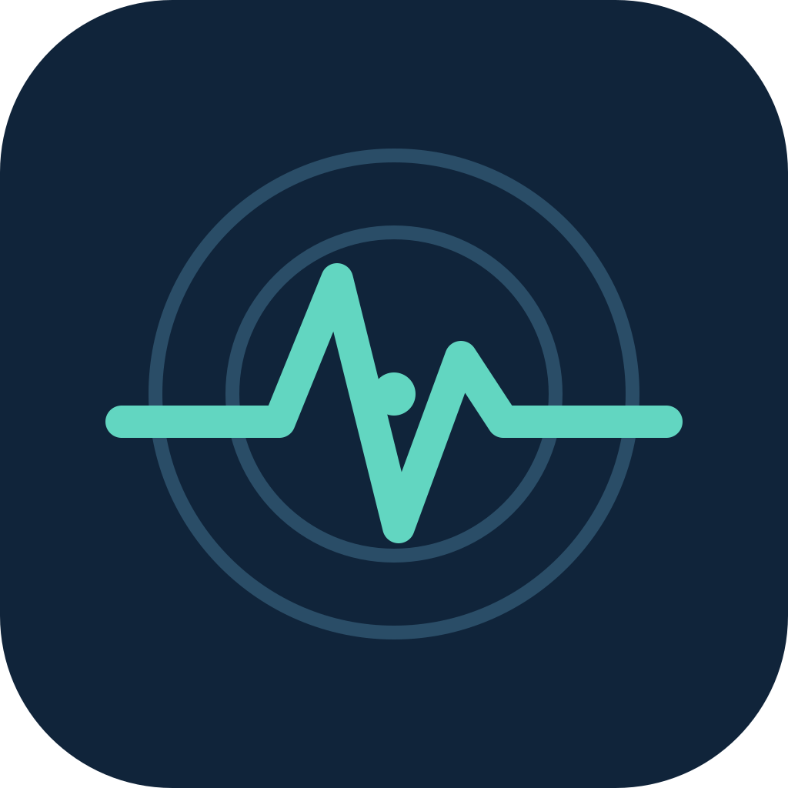
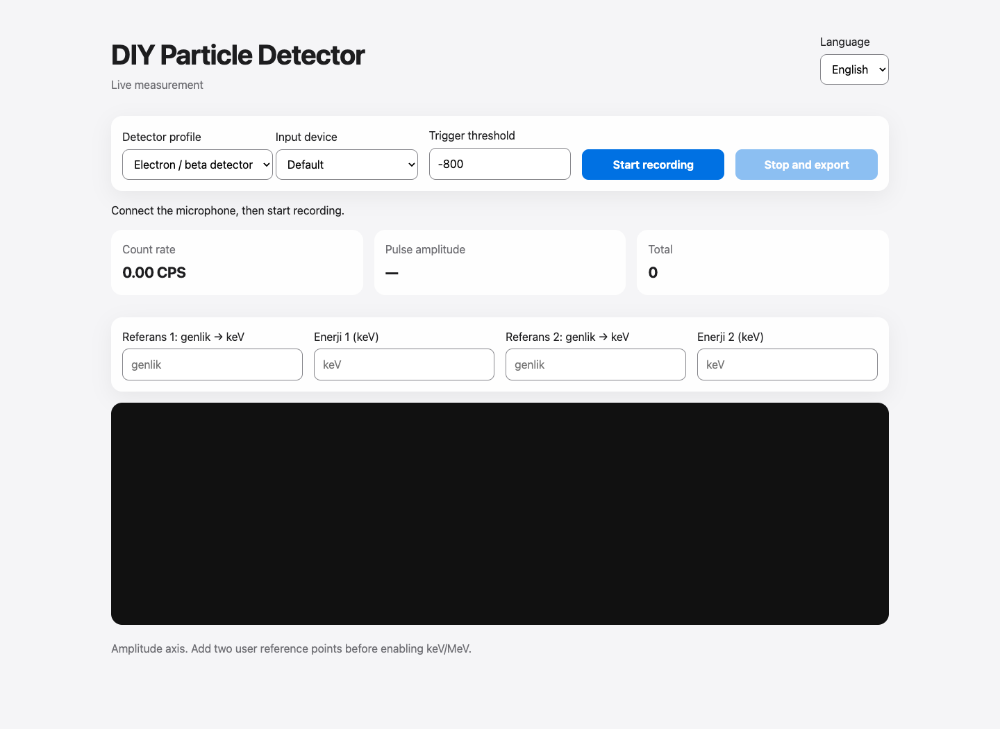

<h1 align="center">DIY Particle Detector</h1>

Recording, live visualization and measurement inspection for audio-based detectors.

<strong>Desktop + Web · Türkçe / English · v0.1.1</strong>

<a href="README.md">Türkçe</a> · English · <a href="https://github.com/Mahmutakin99/project-portfolio/releases/tag/particle-detector-v0.1.1">Download</a>

DIY Particle Detector is desktop and browser software for recording pulse signals from a compatible detector through an audio input. Electron / beta and alpha profiles connect acquisition, counting, portable storage and user calibration in one workflow.

This repository provides the public showcase, distribution and feedback space. Current application source is maintained privately. The underlying hardware, scientific method and original reference measurements come from **Oliver Keller and collaborators' [DIY Particle Detector project](https://github.com/ozel/DIY_particle_detector)**. The contribution presented here is the desktop / web software adaptation and packaging.

## From acquisition to inspection

1. Connect a compatible detector and audio input; choose the profile, input device and threshold.
2. Inspect the live waveform, pulse amplitude and count rate.
3. Stop acquisition and save a portable `.pdet` recording.
4. Reopen it on desktop to inspect the amplitude histogram.
5. Supply valid physical reference points before interpreting an energy axis.

| Capability | Scope |
| --- | --- |
| Desktop recorder | PySide6 interface for acquisition, recordings, analysis and settings |
| Browser recorder | Web Audio live view and `.pdet` export |
| Language and appearance | Turkish / English; desktop light, dark and system themes |
| Portable sessions | Versioned MessagePack files with profile, sampling and calibration metadata |
| Data loss accounting | Queue and sampling losses recorded in the desktop acquisition path |
| Legacy files | `.msgp` import; `.pkl` only with explicit trusted-file acknowledgement |
| Analysis | Amplitude histograms, calibration validation and command-line inspection |

## Download

Choose the matching architecture in the [v0.1.1 release](https://github.com/Mahmutakin99/project-portfolio/releases/tag/particle-detector-v0.1.1). Packaged desktop applications do not require a Python installation.

| System | Package |
| --- | --- |
| macOS Apple Silicon | `DIY-Particle-Detector-macos-arm64.dmg` |
| macOS Intel | `DIY-Particle-Detector-macos-x64.dmg` |
| Windows x64 / ARM64 | Matching `DIY-Particle-Detector-windows-*-Setup.exe` |
| Linux x64 / ARM64 | Matching `DIY-Particle-Detector-linux-*.AppImage` |

On macOS, move the application from the DMG to Applications. On Windows, run the installer. On Linux, grant executable permission to the AppImage. Initial packages lack macOS notarization and Windows code signing. Linux reference environments are Ubuntu 22.04 x64 and Ubuntu 24.04 ARM64; other distributions require a compatible graphical desktop and system libraries.

## Real interface, explicit limits

The gallery was captured from the real web interface on **2 October 2026**. No detector was connected, no microphone access was granted and no recording was started. Zero counts and an empty graph represent startup, not measurement results. Some calibration labels remain Turkish in the English view; this reflects the current application. [Provenance and verification record](PROVENANCE.md).

The source project's methodology note dated 25 September 2026 reports 14 local passing tests and synthetic-recording package smoke checks for v0.1.1. These tests and physical measurements were not rerun while preparing this showcase.

The software **does not calculate radiation dose or automatically identify isotopes**. Raw amplitude is not keV / MeV without calibration. Physical detector validity, noise conditions and actual measurement quality require evaluation separate from software tests.

## Feedback and attribution

Submit a [bug report](https://github.com/Mahmutakin99/project-portfolio/issues/new?template=bug-report.yml) or [feature request](https://github.com/Mahmutakin99/project-portfolio/issues/new?template=feature-request.yml). Include OS, version, interface type and reproduction steps; avoid personal recordings and file paths.

Software adaptation / packaging: [Mahmut AKIN](https://github.com/Mahmutakin99). Original research: Oliver Keller and collaborators, *Sensors* 2019, 19(19), 4264, [doi:10.3390/s19194264](https://doi.org/10.3390/s19194264).

The inherited **BSD-2-Clause** license and Oliver Keller copyright notice are preserved verbatim in [LICENSE](LICENSE). This showcase does not revoke existing open-source rights. Hardware licensing under CERN Open Hardware License remains separate; hardware designs and research measurement datasets are not redistributed here.
