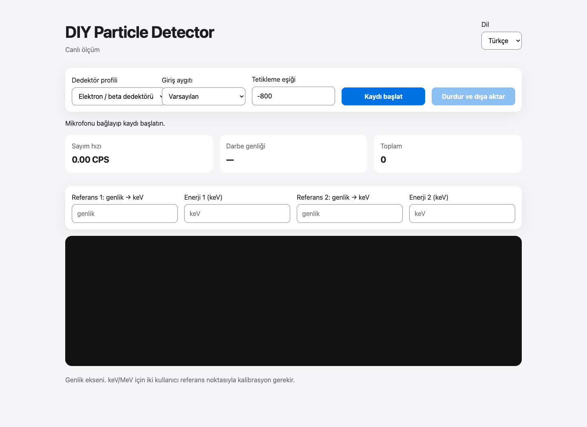

<h1 align="center">DIY Particle Detector</h1>

Ses tabanlı dedektörler için kayıt, canlı görünüm ve ölçüm inceleme.

<strong>Masaüstü + Web · Türkçe / English · v0.1.1</strong>

Türkçe · <a href="README.en.md">English</a> · <a href="https://github.com/Mahmutakin99/project-portfolio/releases/tag/particle-detector-v0.1.1">İndir</a>

DIY Particle Detector, uyumlu dedektörden ses girişine gelen darbe sinyallerini kaydetmek ve daha sonra incelemek için hazırlanmış bir masaüstü ve tarayıcı yazılımıdır. Elektron / beta ve alfa profilleri; kayıt, sayım, dosya saklama ve kullanıcı kalibrasyonunu aynı iş akışında bir araya getirir.

Bu depo ürün tanıtımı, dağıtım ve geri bildirim içindir. Güncel uygulama kaynak kodu özel depoda tutulur. Özgün donanımın, bilimsel yöntemin ve referans ölçümlerinin kaynağı **Oliver Keller ve çalışma arkadaşlarının [DIY Particle Detector projesidir](https://github.com/ozel/DIY_particle_detector)**. Burada sunulan katkı masaüstü / web yazılım uyarlaması ve paketlemedir.

## Kaydı başlatmadan incelemeye

1. Uyumlu dedektör ve ses girişini bağlayın; profil, giriş aygıtı ve eşiği seçin.
2. Canlı dalga biçimi, darbe genliği ve sayım hızını takip edin.
3. Kaydı durdurup taşınabilir `.pdet` dosyasına saklayın.
4. Masaüstünde kaydı yeniden açarak genlik histogramını inceleyin.
5. Enerji yorumu için geçerli fiziksel referans noktalarıyla kalibrasyon yapın.

| Olanak | Kapsam |
| --- | --- |
| Masaüstü kayıt | PySide6 arayüzü; canlı ölçüm, kayıtlar, analiz ve ayarlar |
| Tarayıcı kayıt | Web Audio tabanlı canlı görünüm ve `.pdet` dışa aktarma |
| Dil ve görünüm | Türkçe / İngilizce; masaüstünde açık, koyu ve sistem görünümü |
| Taşınabilir oturum | Sürümlü MessagePack biçimi; profil, örnekleme ve kalibrasyon bilgileri |
| Kayıp örnek bilgisi | Masaüstü kayıt yolunda kuyruk ve örnekleme kayıplarının kaydı |
| Eski kayıtlar | `.msgp` içe aktarma; `.pkl` yalnız açık güvenilir dosya onayıyla |
| Analiz | Genlik histogramı, kalibrasyon denetimi ve komut satırı inceleme |

## İndirme

[v0.1.1 sürüm paketleri](https://github.com/Mahmutakin99/project-portfolio/releases/tag/particle-detector-v0.1.1) içinden işlemcinize uygun dosyayı seçin. Paketli masaüstü uygulaması Python kurulumu gerektirmez.

| Sistem | Paket |
| --- | --- |
| macOS Apple Silicon | `DIY-Particle-Detector-macos-arm64.dmg` |
| macOS Intel | `DIY-Particle-Detector-macos-x64.dmg` |
| Windows x64 / ARM64 | İşlemciye uygun `DIY-Particle-Detector-windows-*-Setup.exe` |
| Linux x64 / ARM64 | İşlemciye uygun `DIY-Particle-Detector-linux-*.AppImage` |

macOS'ta DMG içindeki uygulamayı Uygulamalar'a taşıyın; Windows'ta yükleyiciyi çalıştırın; Linux'ta AppImage'a çalıştırma izni verin. İlk dağıtım paketlerinde macOS noter onayı ve Windows kod imzalama bulunmaz. Linux referans ortamları Ubuntu 22.04 x64 ve Ubuntu 24.04 ARM64'tür; diğer dağıtımlarda uyumlu grafik ortamı ve sistem kütüphaneleri gerekir.

## Gerçek arayüz, açık sınırlar

Galeri, **2 Ekim 2026** tarihinde gerçek web arayüzünden çekildi. Dedektör bağlanmadı, mikrofon erişimi verilmedi ve kayıt başlatılmadı. Sıfır sayımlar ve boş grafik başlangıç durumudur; ölçüm sonucu değildir. İngilizce görünümde bazı kalibrasyon etiketlerinin Türkçe kalması mevcut uygulamanın durumunu yansıtır. [Kaynak ve doğrulama kaydı](PROVENANCE.md).

Kaynak projenin 25 Eylül 2026 yöntem notu, v0.1.1 için 14 yerel test ve sentetik kayıtla paket açılış denetimleri bildirir. Bu tanıtım çalışmasında testler veya fiziksel ölçümler yeniden çalıştırılmadı.

Yazılım **radyasyon dozu hesaplamaz ve izotopları otomatik tanımaz**. Ham genlik, kalibrasyon olmadan keV / MeV değildir. Donanımın fiziksel geçerliliği, gürültü koşulları ve gerçek ölçüm kalitesi yazılım testlerinden ayrı değerlendirilmelidir.

## Geri bildirim ve atıf

[Hata bildirimi](https://github.com/Mahmutakin99/project-portfolio/issues/new?template=bug-report.yml) veya [özellik önerisi](https://github.com/Mahmutakin99/project-portfolio/issues/new?template=feature-request.yml) paylaşabilirsiniz. İşletim sistemi, uygulama sürümü, arayüz türü ve tekrar adımlarını ekleyin; kişisel kayıt veya dosya yollarını paylaşmayın.

Yazılım uyarlaması / paketleme: [Mahmut AKIN](https://github.com/Mahmutakin99). Özgün araştırma: Oliver Keller ve çalışma arkadaşları, *Sensors* 2019, 19(19), 4264, [doi:10.3390/s19194264](https://doi.org/10.3390/s19194264).

Devralınan yazılımın **BSD-2-Clause** lisansı ve Oliver Keller telif bildirimi [LICENSE](LICENSE) dosyasında aynen korunur. Bu tanıtım, mevcut açık kaynak haklarını kaldırmaz. Donanımın CERN Open Hardware License kapsamı ayrıdır; bu depoda donanım tasarımları veya araştırma ölçüm verileri yeniden dağıtılmaz.
